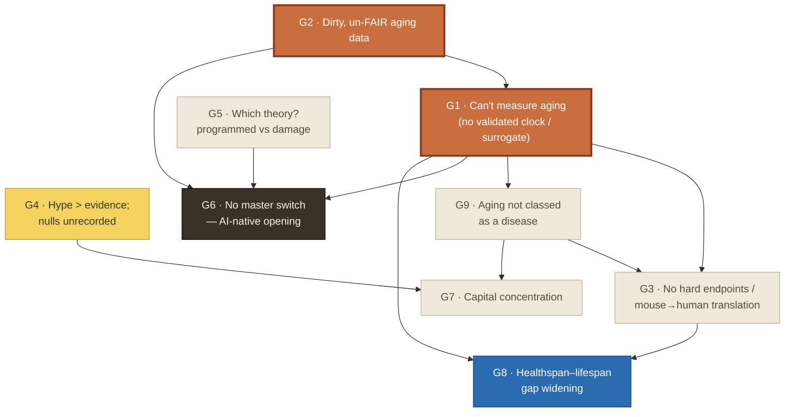

# The problem map — what we're shooting, and why

_Companion to [`gaps-analysis.md`](gaps-analysis.md) (which ranks the gaps) — this shows how the
top problems **relate**, names the **one target** we're shooting, and lists the **low-hanging fruit**
so wins come fast. Problems are the 10 gaps triangulated across 30-day / 30-year / 300-year research._

---

## The relationship graph

Arrows read **"blocks / must come before."** Orange = the **root bottleneck we're shooting** ·
dark = the **AI-native opening** (our longer-term edge) · beige = **needs a lab / capital / regulator**
(not code-only, so not ours to solve) · blue = the **ultimate outcome**.

**The one thing to see:** almost every arrow starts at **G1 (can't measure aging)**, and G1 itself
is fed by **G2 (un-FAIR data)**. *Measurement is the root bottleneck* — you cannot run a trial,
classify aging as a disease, allocate capital well, or close the healthspan gap until you can measure
aging in a shared, validated, reproducible way. And measurement + data are the **only** top problems
that are computational, open-data, and code-only — i.e., the ones a solo builder can actually move.
**Root bottleneck = our lane. That's the whole strategy.**

---

## Top problems, ranked (from the 3-window research)

| # | Problem | Recurrence | Code-only? | Ours? |
|---|---|:--:|:--:|:--:|
| **G1** | Can't measure aging — clocks disagree, no held-out benchmark, no regulatory surrogate | all 3 windows | ✅ | 🎯 **target** |
| **G2** | Dirty / un-FAIR multi-omic aging data; reproducibility unsolved | all 3 windows | ✅ | 🎯 **shipped + extending** |
| G3 | No hard endpoints; mouse→human translation fails | all 3 windows | ❌ needs wet-lab | later (via a lab partner) |
| G4 | Hype outruns evidence; nulls go unrecorded | 2 windows | ✅ | ✅ shipped (nulls registry) |
| G6 | No master switch — the AI-native whole-system-modeling opening | 2 windows | ✅ (hard) | 🔭 longer-term edge |
| G5 | Which theory (programmed vs damage)? capital allocated blind | 2 windows | ❌ | not ours |
| G7 | Capital concentration (reprogramming ≈ 46% of H1-2026 $) | 1 window | ❌ | not ours |
| G8 | Healthspan–lifespan gap widening (the ultimate outcome) | 1 window | ❌ | the goal, not a lever |
| G9 | Aging not classified as a disease | 1 window | ❌ regulator | not ours |
| G10 | Erosion of past wins (AMR stewardship) | 1 window | ❌ | not ours |

Full evidence + citations: [`gaps-analysis.md`](gaps-analysis.md).

---

## 🎯 The target we're shooting — G1 (measurement)

**What:** a shared, reproducible, *validated* way to measure biological age — concretely, climb the
open, code-only **[Biomarkers of Aging Challenge](https://www.longevityprize.com/prize/biomarker)**
leaderboard (via Biolearn) with an honest cross-clock method.

- **Why G1 (not the others):** it's the **root** of the graph — unblocking it is what lets everything
  downstream move — *and* it's the one root problem that's code-only, open-data, no-wet-lab, so a solo
  builder can actually attain it. Highest leverage × highest tractability. (G2 is its feeder and is
  already partly shipped — the [FAIR scorecard](FAIR.md); G6 is the longer-term AI-native edge.)
- **How:** the tooling is already built and gated — the cross-clock disagreement benchmark
  ([`scripts/clockbench.py`](../scripts/clockbench.py), gaps-analysis G1) and the Turn-01 harness
  ([`turns/turn-01-biolearn-baseline`](../turns/turn-01-biolearn-baseline)) that tests whether
  clock *disagreement* adds predictive signal over the best single clock (a code-only proxy for
  Levine's Systems Age). Both run today on synthetic data; they need only the real challenge dataset.
- **When:** the next two rungs of the signal ladder — **run Turn 01 on real data (E6)** in the next
  ~2 weeks, then **first leaderboard submission (E7)**. These are days-of-work away, not months.
- **Success looks like:** a public leaderboard rank + an honest write-up (including the null) that a
  frontier researcher (e.g. Levine, or Zitnik's orbit) would find non-cringe to receive.

---

## 🍎 Low-hanging fruit — quick wins to stay encouraged

Each is **one step away** and has a crisp *done-when* so the win is unambiguous. Attain these in order
and momentum compounds.

| # | Quick win | Done when | Why it's low-hanging |
|--:|---|---|---|
| 1 | **Run Turn 01 on real Biolearn data (E6)** | `results.json` shows a real Δ (or a clean null) and `PROOF.md` is filled | the harness is built, verified end-to-end, and self-checks — only the dataset needs wiring |
| 2 | **First leaderboard submission (E7)** | a public rank/percentile exists | your first external, credibility-gated signal — turns the repo from "scaffold" to "on the board" |
| 3 | **One warm reply from a researcher (E10 / E13)** | one named researcher replies to outreach | the artifacts (clockbench, FAIR scorecard, nulls registry) + the one-pager are ready; you have proof-in-hand |

> Rule for staying encouraged: **ship the fruit before the harder gaps.** G3/G5/G7/G9 need a lab,
> capital, or a regulator — deliberately *not* on this list. Celebrate G1's wins first; they unlock
> the credibility and collaborators that make the hard problems reachable.

---

_Not medical advice. Computational targets on open data, kept separate from any wet-lab/therapeutic
claim. No evidence ⇒ no claim._
